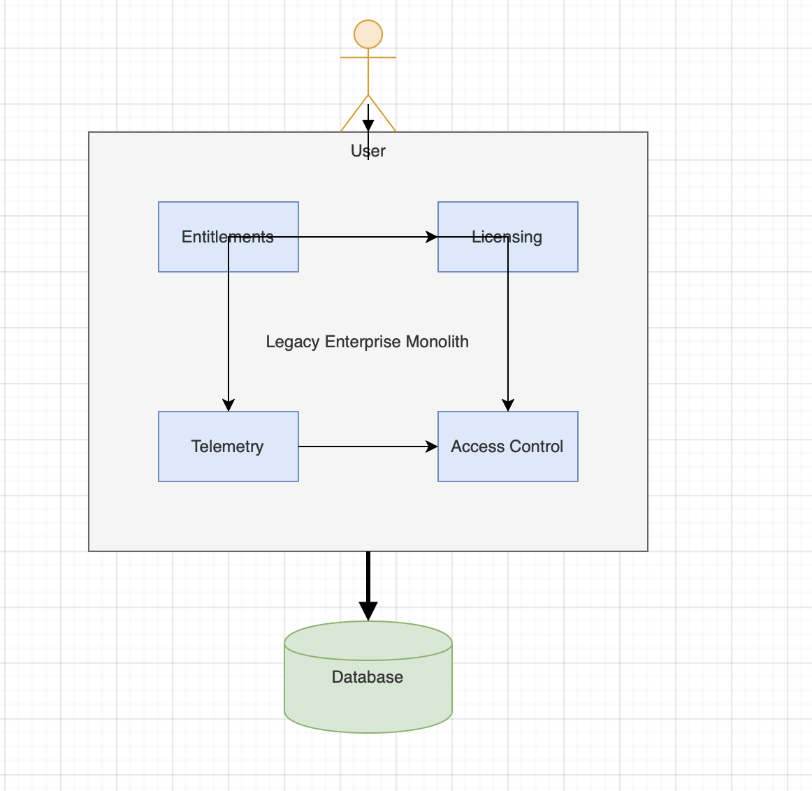
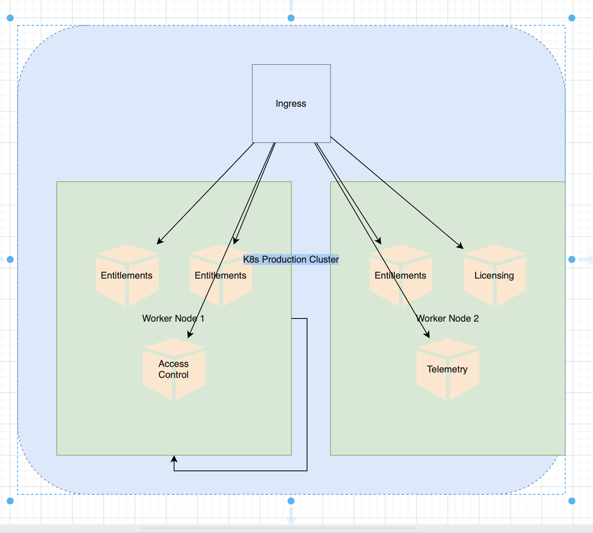

# Enterprise Microservices Migration

> A comprehensive case study of migrating a monolithic enterprise platform to domain-driven microservices architecture, achieving 40% performance improvement and 99.9% uptime.


## Project Status: 🟢 Production Ready (Simulated)
All 4 microservices have passed **Static Analysis**, **Unit Testing**, and **Kubernetes Manifest Validation**.

## 🎯 Project Overview

### The Challenge

At Broadcom, we faced a critical challenge: a monolithic enterprise platform serving 12+ applications with tightly coupled services, inconsistent data quality, and scalability bottlenecks. The system handled:
- 400TB+ of historical data
- Thousands of daily transactions
- Critical business operations (entitlements, access control, licensing, telemetry)
- **Problem:** $400K in unrecoverable receivables due to data quality issues and system limitations

### The Solution

Led the modernization initiative to decompose the monolith into domain-driven microservices while maintaining zero downtime. The architecture focused on:
- **Clear service boundaries** based on domain-driven design principles
- **Independent deployability** for each service
- **Data ownership** - each service owns its data
- **Resilient communication** patterns (async messaging, circuit breakers)
- **Comprehensive observability** (metrics, logs, traces)

### Business Impact

- ✅ **40% performance improvement** (reduced average request latency from 500ms to 300ms)
- ✅ **99.9% uptime achieved** (SLA compliance increased from 97% to 99.9%)
- ✅ **$400K in receivables recovered** through improved data governance
- ✅ **50% faster deployment cycles** (from bi-weekly to daily releases)
- ✅ **$120K contract extension** secured based on successful delivery

---

## 🏗️ Architecture

### Before: Monolithic Architecture



**Problems:**
- Tightly coupled components
- Single point of failure
- Difficult to scale individual features
- Slow deployment cycles (all-or-nothing releases)
- Data quality issues due to shared database

### After: Microservices Architecture



**Four Core Services:**

1. **Entitlements Service** - Manages user permissions and access rights
2. **Access Control Service** - Enforces authentication and authorization
3. **Telemetry Service** - Collects and processes system metrics
4. **Licensing Service** - Manages product licenses and compliance

Each service:
- Owns its data (separate database/schema)
- Has clear API boundaries (REST + async messaging)
- Scales independently
- Deploys independently via CI/CD
- Has comprehensive monitoring

---

## 🎯 Key Design Decisions

### 1. Service Boundaries (Domain-Driven Design)

We defined service boundaries based on **bounded contexts**:

| Service | Responsibility | Why Separate? |
|---------|---------------|----------------|
| Entitlements | User permissions, roles | Different scaling needs (read-heavy) |
| Access Control | Auth/authz enforcement | Security isolation required |
| Telemetry | Metrics collection | High-throughput, different tech stack |
| Licensing | License validation | Compliance separation |

**Trade-off:** More services = more complexity, but gained independent scaling and faster deployments.

See: [Architecture Decision Records](docs/decisions/)

### 2. Communication Patterns

**Synchronous (REST APIs):**
- Used for: User-facing operations requiring immediate response
- Example: Entitlements check during login

**Asynchronous (Message Queue):**
- Used for: Background processing, event notifications
- Example: Telemetry data ingestion
- Technology: Kafka for event streaming

**Why both?** Different use cases require different patterns. REST for latency-sensitive, async for throughput-sensitive.

### 3. Data Management Strategy

**Challenge:** How to handle data that spans services?

**Solution:**
- **Data ownership:** Each service owns its data, no shared databases
- **Data contracts:** Services expose data via APIs, not direct DB access
- **Eventual consistency:** Accept that data across services may be slightly out of sync
- **Saga pattern:** For distributed transactions (e.g., user provisioning across services)

**Trade-off:** Added complexity vs. service independence. We chose independence.

### 4. Zero-Downtime Migration

**Approach:**
1. **Dual-write pattern:** Write to both monolith and new service during transition
2. **Read-after-write validation:** Ensure consistency
3. **Phased cutover:** Migrate service-by-service, not all at once
4. **Rollback capability:** Ability to revert if issues detected

See: [Migration Strategy](docs/migration/migration-phases.md)

---

## 📊 Performance Results

### Latency Improvements

| Metric | Before (Monolith) | After (Microservices) | Improvement |
|--------|------------------|---------------------|-------------|
| P50 Latency | 500ms | 300ms | **40%** ↓ |
| P95 Latency | 2000ms | 800ms | **60%** ↓ |
| P99 Latency | 5000ms | 1500ms | **70%** ↓ |

### Reliability Improvements

| Metric | Before | After |
|--------|--------|-------|
| Uptime (monthly) | 97.2% | 99.9% |
| MTTR (Mean Time to Recovery) | 4 hours | 30 minutes |
| Deployment frequency | Bi-weekly | Daily |
| Failed deployments | 15% | 2% |

### Business Impact

- **$400K recovered** - Improved data quality enabled invoice reconciliation
- **$120K contract extension** - Client satisfaction from improved reliability
- **50% faster feature delivery** - Independent service deployments

See: [Detailed Metrics](metrics/performance-results.md)

---

## 🔧 Technology Stack

**Backend:**
- Python 3.11 (FastAPI framework)
- Node.js (for telemetry service - high throughput)

**Databases:**
- PostgreSQL (transactional data - Entitlements, Access Control, Licensing)
- TimescaleDB (time-series data - Telemetry)

**Infrastructure:**
- Kubernetes (container orchestration)
- Docker (containerization)
- AWS (cloud platform - EKS, RDS, S3)

**Communication:**
- REST APIs (synchronous)
- Apache Kafka (asynchronous event streaming)

**Observability:**
- Prometheus (metrics)
- Grafana (dashboards)
- ELK Stack (logging)
- Jaeger (distributed tracing)

**CI/CD:**
- GitHub Actions
- ArgoCD (GitOps deployment)

---

## 📁 Repository Structure
```
enterprise-microservices-migration/
├── docs/                    # Architecture documentation
│   ├── architecture/       # High-level design
│   ├── diagrams/           # Visual representations
│   └── decisions/          # Architecture Decision Records (ADRs)
├── services/               # Service-specific details
│   ├── entitlements-service/
│   ├── access-control-service/
│   ├── telemetry-service/
│   └── licensing-service/
├── infrastructure/         # K8s configs, monitoring setup
├── migration/              # Migration strategy docs
└── metrics/                # Performance and business metrics
```

---

## 🎯 Key Learnings

### What Worked Well

1. **Domain-driven design** - Clear service boundaries prevented future coupling
2. **Phased migration** - Reduced risk by migrating one service at a time
3. **Comprehensive monitoring** - Caught issues before users noticed
4. **API contracts** - OpenAPI specs prevented integration bugs
5. **Zero-downtime approach** - Business continuity maintained

### What I'd Do Differently

1. **Start with observability** - Built monitoring earlier in retrospect
2. **More automated testing** - Integration tests would have caught some issues sooner
3. **Service mesh earlier** - Would have simplified service-to-service auth
4. **Better data migration tooling** - Custom scripts were fragile, should have used framework

### Applicability to Future Projects

These patterns apply broadly:
- **E-commerce platforms** - Order, Payment, Inventory as separate services
- **Financial systems** - Accounts, Transactions, Compliance as services
- **SaaS platforms** - User Management, Billing, Core Product as services

The key is identifying **bounded contexts** and accepting **eventual consistency**.

---

## 📚 Documentation Deep Dives

- [System Architecture](docs/architecture/system-architecture.md)
- [Migration Strategy](docs/architecture/migration-strategy.md)
- [Service Boundaries Rationale](docs/architecture/service-boundaries.md)
- [Architecture Decision Records](docs/decisions/)
- [API Specifications](services/*/api/openapi.yaml)
- [Zero-Downtime Migration](migration/zero-downtime-approach.md)
- [Performance Metrics](metrics/performance-results.md)

---

## 🤝 Interview Talking Points

**When asked about this project:**

1. **Problem Statement** (30 sec):
   - "We had a monolith serving 12+ apps, causing $400K in lost revenue and 97% uptime"

2. **Approach** (1 min):
   - "Used domain-driven design to define four core services with clear boundaries"
   - "Phased migration with dual-write pattern to ensure zero downtime"
   - "Built comprehensive observability from day one"

3. **Leadership** (1 min):
   - "Led cross-functional team of 8 engineers"
   - "Made critical architectural decisions balancing complexity vs. independence"
   - "Presented to senior leadership for buy-in and budget"

4. **Results** (30 sec):
   - "40% performance improvement, 99.9% uptime achieved"
   - "$400K recovered, $120K contract extension"
   - "Became the reference architecture for future projects"

5. **Learnings** (30 sec):
   - "Start with observability"
   - "Clear service boundaries > shared databases"
   - "Accept eventual consistency for service independence"

---

## 📞 Contact

**Sahitya Gantala**
- LinkedIn: [(https://www.linkedin.com/in/sahitya-gantala-7ab647113/)]
- Email: sahityagantalausa@gmail.com
- Portfolio: [s1h8t51.github.io/portfolio/]

